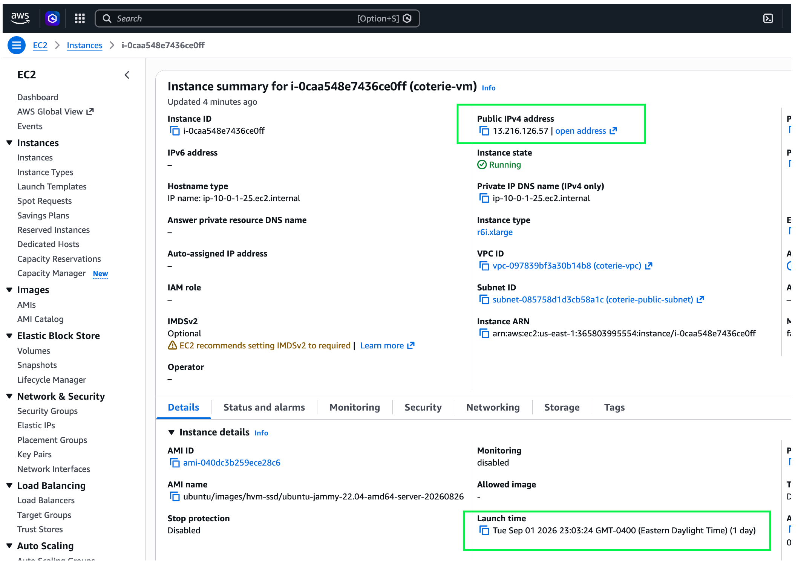
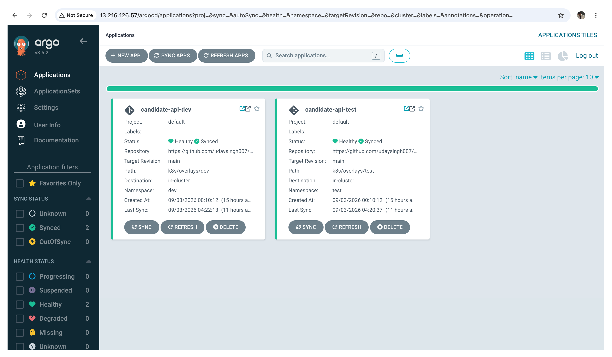
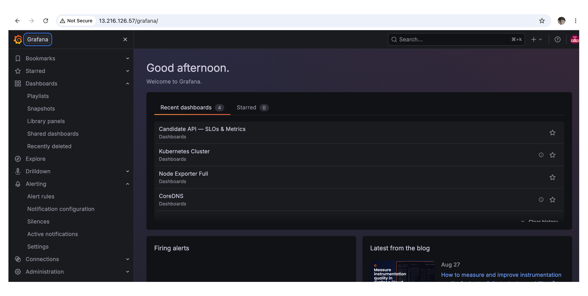

# This repo contains all the IaC for infra for 'sre-take-home'

1. The foundation layer is AWS infrastructure, provisioned via Terraform — an r6i.xlarge EC2 instance with an Elastic IP in us-east-1.
2. A lightweight K3s Kubernetes cluster runs on that single VM, serving as the platform for all workloads.
3. The cluster hosts Prometheus and Grafana for metrics collection, dashboards, SLO tracking, and alerting.
4. ArgoCD is deployed as the continuous delivery agent, pulling updated Kubernetes manifests directly from the [sre-take-home](https://github.com/udaysingh007/sre-take-home) GitHub repo. This GitOps approach avoids SSH access or kubectl exposure to GitHub Actions, which would be more intrusive and less elegant.
6. Two namespaces — `dev` and `test` — host the .NET API service, deployed via the sre-take-home CI workflows through ArgoCD.
7. ArgoCD also provides per-pod log access; for this assessment that is sufficient, but logging can be expanded for longer-term retention.
8. A synthetic monitor pod continuously hits the API endpoints, generating metrics such as response times and request rates.
9. A runbook-controller pod automates incident response — specifically, reverting a bad deployment via the GitHub API when post-deploy health checks fail.
10. A landing-page web server (nginx) provides a single entry point with links to all deployed environments and platform tools.
11. Everything runs on a single VM by design to keep costs under $150 for 30 days; AWS infra was provisioned on Sep 1st, 2026.
12. The expectation is that this will be demoed and torn down within 10 days of provisioning.

# TL;DR
  - Foundation: AWS EC2 via Terraform with Elastic IP
  - Platform: K3s cluster on the VM
  - Observability: Prometheus + Grafana (metrics, dashboards, SLOs, alerting)
  - CD: ArgoCD pulling manifests from GitHub (GitOps)
  - App namespaces: dev + test for the .NET API
  - Logging: ArgoCD pod-level logs, extensible for the future
  - Synthetic monitoring: dedicated pod for API metrics
  - Incident response: runbook-controller automating rollbacks via GitHub API
  - Landing page: nginx entry point linking to all tools/environments
  - Cost/timeline: single VM design, $150/30-day budget, provisioned on Sep 1st, 2026 (just for this assessment)

# Screenshots

### AWS EC2 Instance (with launch time - Sep 1st, 2026 @11pm EST)

### ArgoCD — GitOps Deployments

### Grafana — Dashboards & Observability

